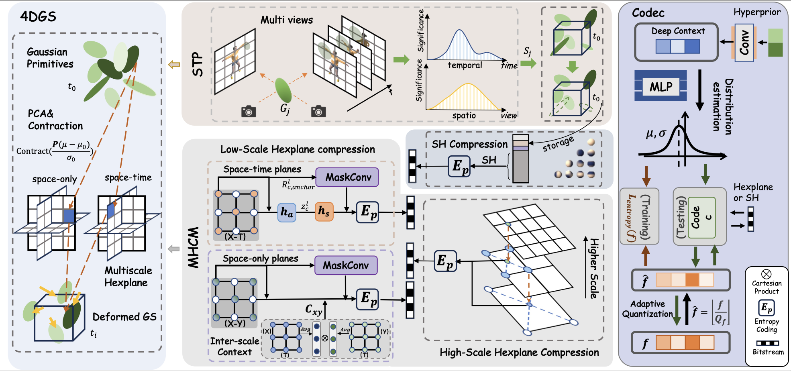

# Light4GS: Lightweight Compact 4D Gaussian Splatting Generation via Context Model

Mufan Liu¹, Qi Yang², He Huang¹, Wenjie Huang¹, Zhenlong Yuan³, Zhu Li², Yiling Xu¹†  

¹ Shanghai Jiao Tong University  
² University of Missouri, Kansas City  
³ University of Chinese Academy of Sciences  

Contact: sudo_evan@sjtu.edu.cn

<p align="center">
  
</p>
Overview of Light4GS architecture.

## 🏠 Environmental Setups

Please follow the [3D-GS](https://github.com/graphdeco-inria/gaussian-splatting) to install the relative packages.

```bash
git clone https://github.com/Evan-sudo/Light4GS
cd Light4GS
conda create -n Light4GS python=3.7 
conda activate Light4GS

pip install -r requirements.txt
pip install -e submodules/depth-diff-gaussian-rasterization
pip install -e submodules/simple-knn
```

We modified the "diff-gaussian-rasterization" in the submodule following [LightGaussian](https://github.com/VITA-Group/LightGaussian/) to get the Global Significant Score. In our environment, we use pytorch=1.13.1+cu116.

## 📚 Data Preparation

**For synthetic scenes:**
The dataset provided in [D-NeRF](https://github.com/albertpumarola/D-NeRF) is used. You can download the dataset from [dropbox](https://www.dropbox.com/s/0bf6fl0ye2vz3vr/data.zip?dl=0).

**For real dynamic scenes:**
The dataset provided in [HyperNeRF](https://github.com/google/hypernerf) and [NeRF-DS](https://github.com/JokerYan/NeRF-DS) is used. You can download scenes from [Hypernerf Dataset](https://github.com/google/hypernerf/releases/tag/v0.1) & [NeRF-DS Dataset](https://github.com/JokerYan/NeRF-DS/releases/tag/v0.1-pre-release) and organize them as [Nerfies](https://github.com/google/nerfies#datasets). 


```
├── data
│   | dnerf 
│     ├── mutant
│     ├── standup 
│     ├── ...
│   | hypernerf (NeRF-DS)
│     ├── virg
│   | dynerf 
│     ├── cook_spinach
│       ├── cam00
│           ├── images
│               ├── 0000.png
│               ├── 0001.png
│               ├── 0002.png
│               ├── ...
│       ├── cam01
│           ├── images
│               ├── 0000.png
│               ├── 0001.png
│               ├── ...
│     ├── cut_roasted_beef
|     ├── ...
```
### !Note:
To ensure valid masked convolution under the checkerboard context, we set all HexPlane dimensions to be multiples of 4. Note that the pruning iteration should also be later than the iteration at which the Gaussians stop densifying.

## 🚀 Training

The training of Light4GS follows the implementation of the paper [4DGS](https://github.com/hustvl/4DGaussians).
For training synthetic scenes such as `bouncingballs`, run

```
python train.py -s data/dnerf/bouncingballs --port 6017 --expname "dnerf/bouncingballs" --configs arguments/dnerf/bouncingballs.py 
```

For training dynerf scenes such as `cut_roasted_beef`, run
```python
# First, extract the frames of each video.
python scripts/preprocess_dynerf.py --datadir data/dynerf/cut_roasted_beef
# Second, generate point clouds from input data.
bash colmap.sh data/dynerf/cut_roasted_beef llff
# Third, downsample the point clouds generated in the second step.
python scripts/downsample_point.py data/dynerf/cut_roasted_beef/colmap/dense/workspace/fused.ply data/dynerf/cut_roasted_beef/points3D_downsample2.ply
# Finally, train.
python train.py -s data/dynerf/cut_roasted_beef --port 6017 --expname "dynerf/cut_roasted_beef" --configs arguments/dynerf/cut_roasted_beef.py 
```

For training hypernerf or nerf-ds scenes such as `virg/broom`: Pregenerated point clouds by COLMAP are provided [here](https://drive.google.com/file/d/1fUHiSgimVjVQZ2OOzTFtz02E9EqCoWr5/view). Just download them and put them in to correspond folder, and you can skip the former two steps. Also, you can run the commands directly.

```python
# First, computing dense point clouds by COLMAP
bash colmap.sh data/hypernerf/virg/broom2 hypernerf
# Second, downsample the point clouds generated in the first step. 
python scripts/downsample_point.py data/hypernerf/virg/broom2/colmap/dense/workspace/fused.ply data/hypernerf/virg/broom2/points3D_downsample2.ply
# Finally, train.
python train.py -s  data/hypernerf/virg/broom2/ --port 6017 --expname "hypernerf/broom2" --configs arguments/hypernerf/broom2.py 
```
## ⏰ Compression
We employ STP to prune deformable Gaussian primitives, with the pruning iteration set to [13000, 17000] by default.  

HEXPLANE is compressed using a Multiscale Hexplane Context Model, implemented on top of [CompressAI](https://github.com/InterDigitalInc/CompressAI), where an entropy constraint is applied every 3 iterations.  

The AC components of the SH coefficients are compressed with a fully factorized entropy model, and likewise use an entropy constraint every 3 iterations.  

Compression and decompression are evaluated every 10,000 iterations.  

The model-saving iteration should include the final training iteration, which stores the decoded 4DGS model. This decoded model is identical to the one in [4DGS](https://github.com/hustvl/4DGaussians), so you can directly use the original 4DGS scripts for rendering, FPS measurement, and metric evaluation.
