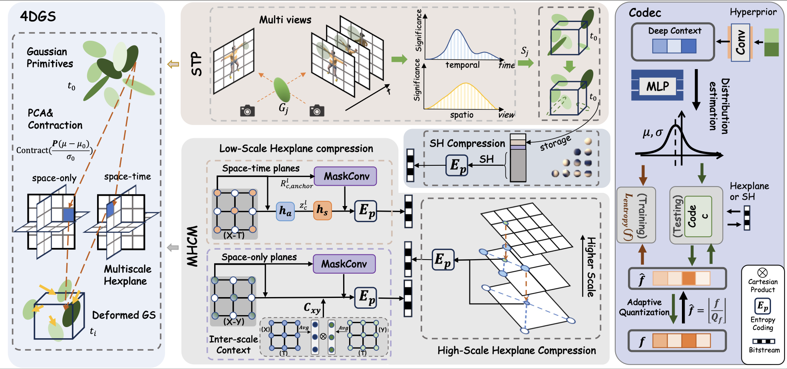
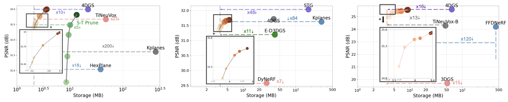

# [TCSVT 25'] Light4GS: Lightweight Compact 4D Gaussian Splatting Generation via Context Model


Contact: sudo_evan@sjtu.edu.cn

<p align="center">
  
</p>
Overview of Light4GS architecture.

## 🏠 Environmental Setups

Please follow the [3D-GS](https://github.com/graphdeco-inria/gaussian-splatting) to install the relative packages.

```bash
git clone https://github.com/Evan-sudo/Light4GS
cd Light4GS
conda create -n Light4GS python=3.7 
conda activate Light4GS

pip install -r requirements.txt
pip install -e submodules/depth-diff-gaussian-rasterization
pip install -e submodules/simple-knn
```

We modified the "diff-gaussian-rasterization" in the submodule following [LightGaussian](https://github.com/VITA-Group/LightGaussian) to get the Global Significant Score. In our environment, we use pytorch=1.13.1+cu116.

## 📚 Data Preparation

**For synthetic scenes:**

The dataset provided in [D-NeRF](https://github.com/albertpumarola/D-NeRF) is used. You can download the dataset from [dropbox](https://www.dropbox.com/s/0bf6fl0ye2vz3vr/data.zip?dl=0).

**For real dynamic scenes:**

1️⃣ Multiview dataset:
The dataset provided in [DyNeRF](https://arxiv.org/pdf/2103.02597) is used. You can download scenes from [Neu3D](https://github.com/facebookresearch/Neural_3D_Video).

2️⃣ Monocular dataset:
The dataset provided in [HyperNeRF](https://github.com/google/hypernerf) and [NeRF-DS](https://github.com/JokerYan/NeRF-DS) is used. You can download scenes from [Hypernerf Dataset](https://github.com/google/hypernerf/releases/tag/v0.1) & [NeRF-DS Dataset](https://github.com/JokerYan/NeRF-DS/releases/tag/v0.1-pre-release) and organize them as [Nerfies](https://github.com/google/nerfies#datasets). 


```
├── data
│   | dnerf 
│     ├── mutant
│     ├── standup 
│     ├── ...
│   | hypernerf / NeRF-DS
│     ├── virg
│   | dynerf 
│     ├── cook_spinach
│       ├── cam00
│           ├── images
│               ├── 0000.png
│               ├── 0001.png
│               ├── 0002.png
│               ├── ...
│       ├── cam01
│           ├── images
│               ├── 0000.png
│               ├── 0001.png
│               ├── ...
│     ├── cut_roasted_beef
|     ├── ...
```
### ‼️ Note:

- To ensure valid masked convolution under the checkerboard context, we set all HexPlane dimensions in ./arguments to be **multiples of 4**. 

- The **pruning iteration** should also be later than the iteration at which the Gaussians stop densifying.
  
- The model-saving iteration should include the **final training iteration**, which stores the decoded 4DGS model.

- The current version does not include adaptive quantization, as it does not work stably across all scenes.

## 🚀 Training

The training of Light4GS follows the implementation of the paper [4DGS](https://github.com/hustvl/4DGaussians).
For training synthetic scenes such as `bouncingballs`, run

```
chmod +x train_dnerf.sh
./train_dnerf.sh
```

Similarly, run `train_dynerf.sh`, `train_hyper.sh` and `train_nerfds.sh` for real-world scene tests.

For training hypernerf or nerf-ds scenes such as `virg/broom`: Pregenerated point clouds by COLMAP are provided [here](https://drive.google.com/file/d/1fUHiSgimVjVQZ2OOzTFtz02E9EqCoWr5/view). Just download them and put them in to correspond folder, and you can skip the former two steps. Also, you can run the commands directly.


## ⏰ Compression
<p align="center">
  
</p>
Compression performance. From left to right: D-NeRF, DyNeRF and HyperNeRF.


### 🌟 Feature compression:
HEXPLANE is compressed using our context model, implemented on top of [CompressAI](https://github.com/InterDigitalInc/CompressAI), where an entropy constraint is applied every 3 iterations.  

### 🌟 GS compression:
- We utimize spatio-temporal rendering significance to prune deformable Gaussian primitives, with the pruning iteration set to [13000, 17000] by default.  
- The AC components of the SH coefficients are compressed with a fully factorized entropy model, and likewise use an entropy constraint every 3 iterations.  

Compression and decompression are evaluated every 10,000 iterations. Bitstreams are stored in ./bitstream (including SH AC and Hexplanes).

### 🌟 Validation and Evaluation:
The model-saving iteration should include the **final training iteration**, which stores the decoded 4DGS model. This decoded model is identical to the one in [4DGS](https://github.com/hustvl/4DGaussians), so you can directly use the original 4DGS scripts for rendering, FPS measurement, and metric evaluation.

## 💻 Citation
If you find our work helpful, please cite:

    @article{liu2025light4gs,
      title   = {Light4GS: Lightweight Compact 4D Gaussian Splatting Generation via Context Model},
      author  = {Liu, Mufan and Yang, Qi and Huang, He and Huang, Wenjie and Yuan, Zhenlong and Li, Zhu and Xu, Yiling},
      journal = {arXiv preprint arXiv:2503.13948},
      year    = {2025}
    }

Also see our anchor-based compression solution for 4DGS [ADC-GS](https://github.com/H-Huang774/ADC-GS):

    @inproceedings{huang2025adcgs,
      title     = {ADC-GS: Anchor-Driven Deformable and Compressed Gaussian Splatting for Dynamic Scene Reconstruction},
      author    = {Huang, He and Yang, Qi and Liu, Mufan and Xu, Yiling and Li, Zhu},
      booktitle = {Proceedings of the Thirty-Fourth International Joint Conference on Artificial Intelligence (IJCAI)},
      year      = {2025}
    }
    
## ♻️ Acknowledgement
We gratefully acknowledge [4DGS](https://github.com/hustvl/4DGaussians) as the foundation of our work, and we drew inspiration from [LightGaussian](https://github.com/VITA-Group/LightGaussian) and [CNC](https://github.com/YihangChen-ee/CNC).
